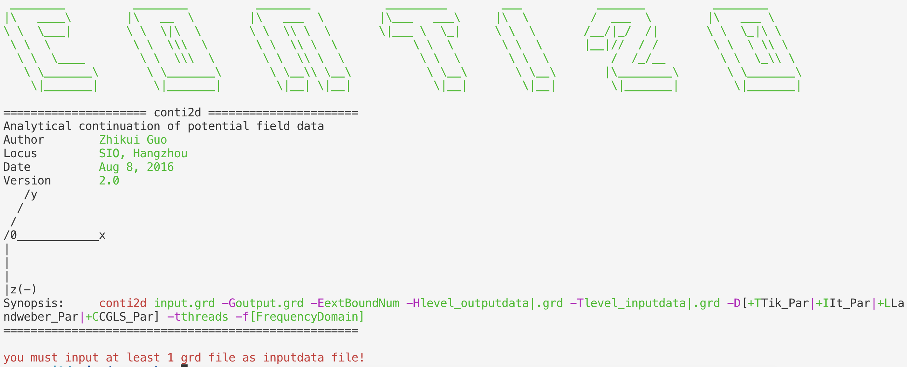
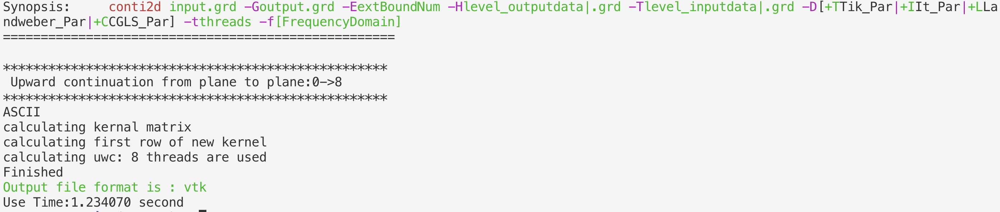
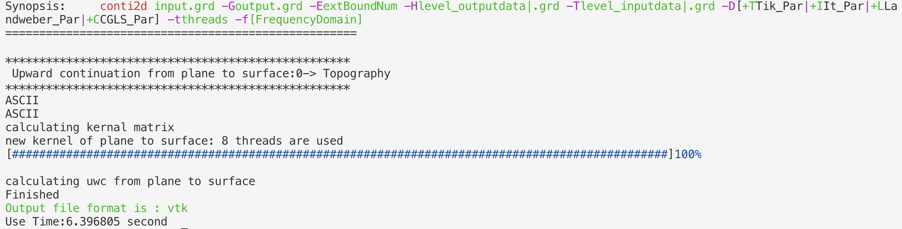
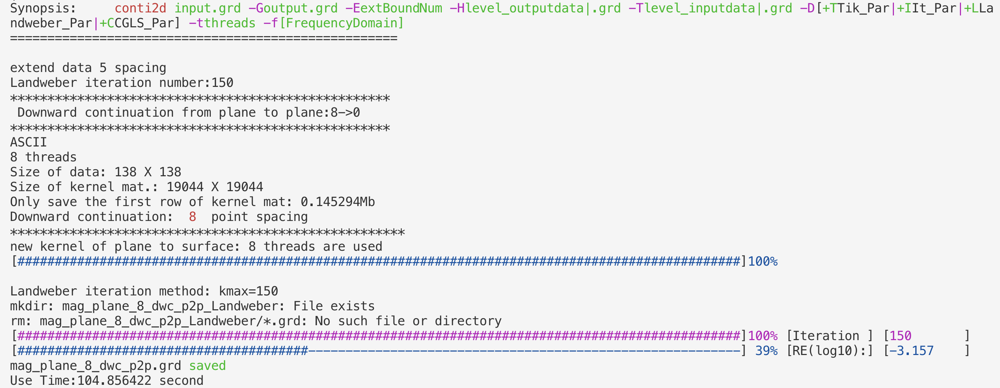
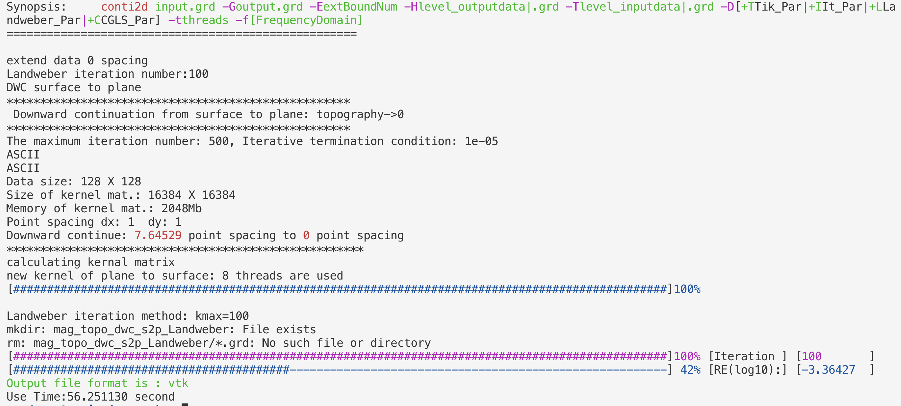

# conti2d

   [](https://github.com/CosmicScholar/conti2d/archive/2.0.zip)   [](https://github.com/CosmicScholar/conti2d)[](https://github.com/CosmicScholar/conti2d)

 [](https://cosmicscholar.github.io/conti2d/)

# Manual

## Hellow World



    The data and run scripts are in the example folder

## 1. Upward Continuation from Plane to Plane

```bash
field_path=../data
field_in=mag_plane_0
field_out=${field_in}_uwc_p2p.vtk
height_uwc=8
conti2d ${field_path}/${field_in}.grd -G${field_out} -H$height_uwc
```


## 2. Upward Continuation from Plane to Surface

```bash
field_path=../data
field_in=mag_plane_0
field_out=${field_in}_uwc_p2s.vtk
topo_in=topo
conti2d ${field_path}/${field_in}.grd -G${field_out} -T0 -H${field_path}/${topo_in}.grd 
```


## 3. Downward Continuation from Plane to Plane

```bash
field_path=../data
field_in=mag_plane_8
field_out=${field_in}_dwc_p2p.grd
height_dwc=8
conti2d ${field_path}/${field_in}.grd -G${field_out} -E5 -H0 -T$height_dwc -D+L1500  
```


## 4. Downward Continuation from Surface to Plane

```bash
field_path=../data
field_in=mag_topo   
field_out=${field_in}_dwc_s2p.vtk
topofile=${field_path}/topo.grd
conti2d ${field_path}/${field_in}.grd -G${field_out} -E0 -H0 -T$topofile -D+L1500 
```
